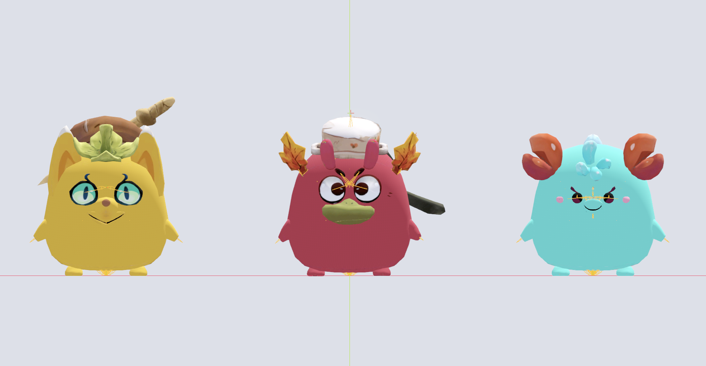
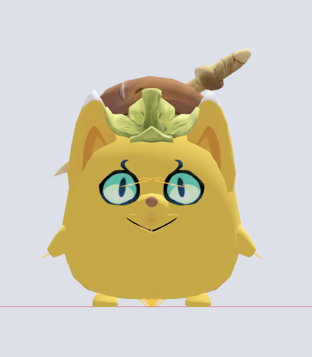
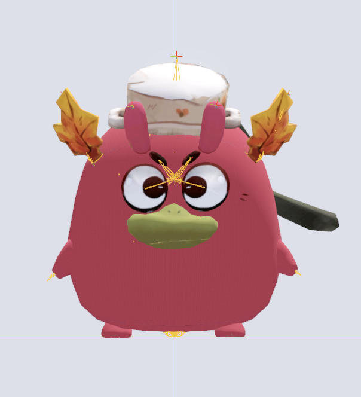
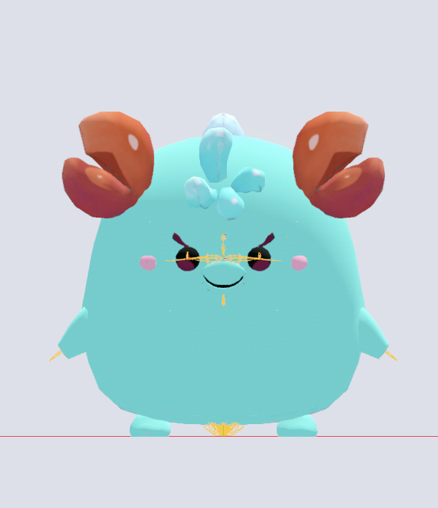
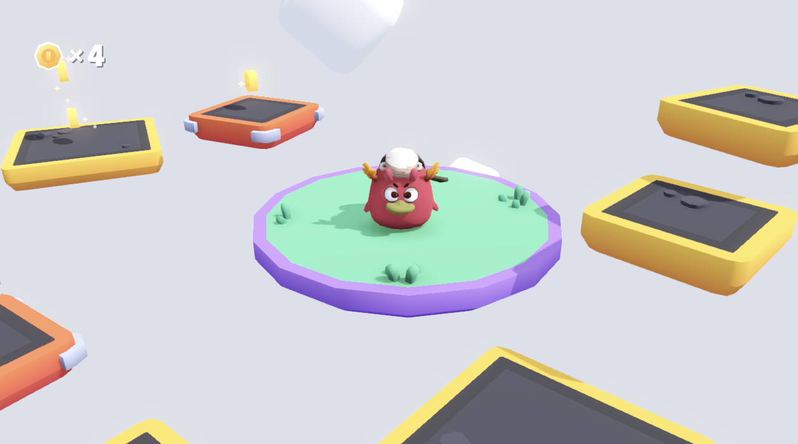

# Axie Starter 3D

	<picture>
		
	</picture>

### Structures

#### Buba

	<picture>
		
	</picture>

-   Scene: `buba.tscn`
-   Textures: `textures/buba.jpg`
-   Animations: `animations/buba/*`
-   Rig: `model/buba.fbx`

#### Pomodoro

	<picture>
		
	</picture>

-   Scene: `pomodoro.tscn`
-   Textures: `textures/pomodoro.jpg`
-   Animations: `animations/pomodoro/*`
-   Rig: `model/pomodoro.fbx`

#### Puffy

	<picture>
		
	</picture>

-   Scene: `puffy.tscn`
-   Textures: `textures/puffy.jpg`
-   Animations: `animations/puffy/*`
-   Rig: `model/puffy.fbx`

### Examples

The original starter kit is from [@Kenney](https://twitter.com/KenneyNL).

`example/scenes/main.tscn`

	<picture>
		
	</picture>

